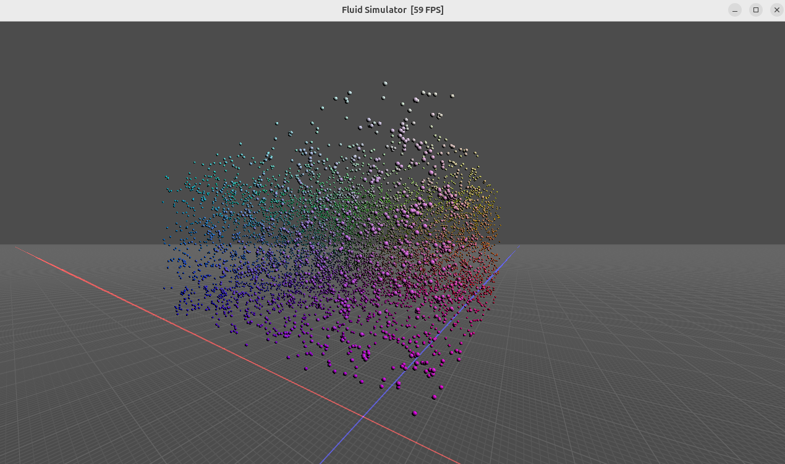

Project during development.

Consists of two parts:
- Lagrangian simulator of fluid. Written in `cuda` on GPU.
- Visualizator in `OpenGL`.

#### Current project status

A particle simulation is basically implemented. Allows to aply forces etc. Current version out of the box runs with gravity and pressure applied.

Visualization is implemented with `cuda`-`OpenGL` interop.

#### Bibliography

TODO: supply source papers...
